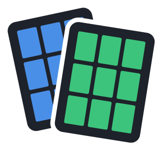
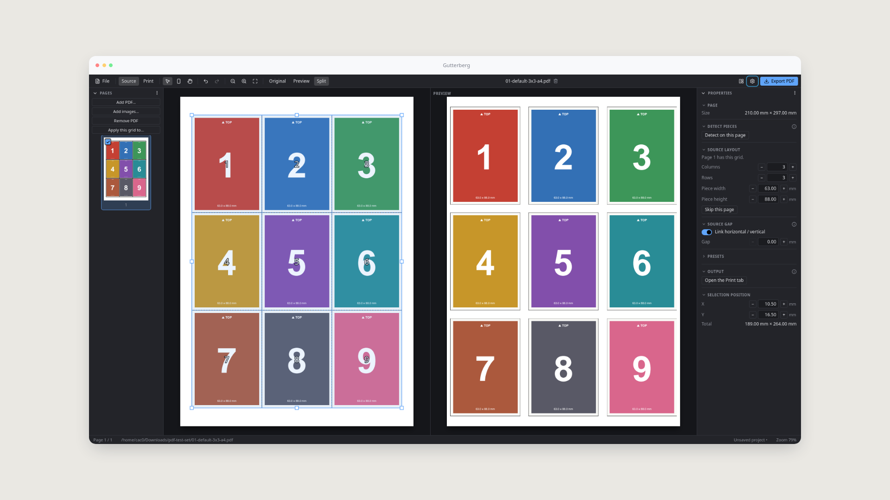
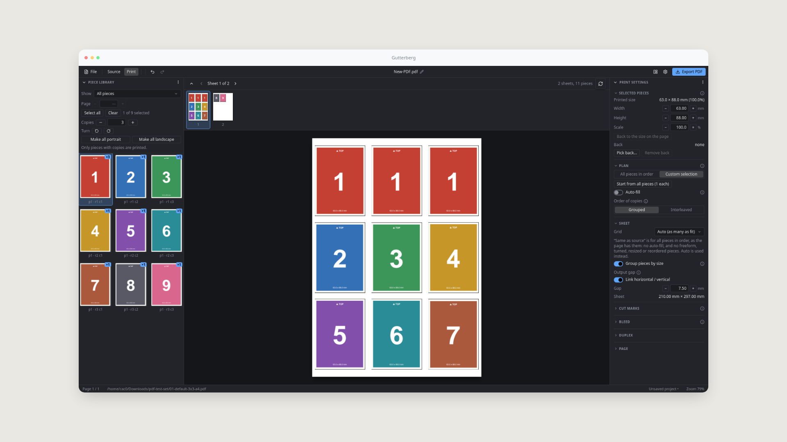
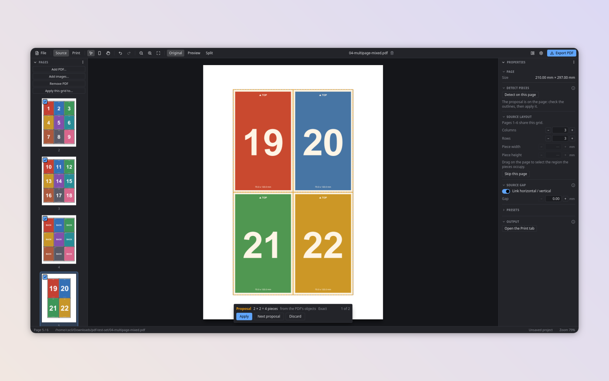
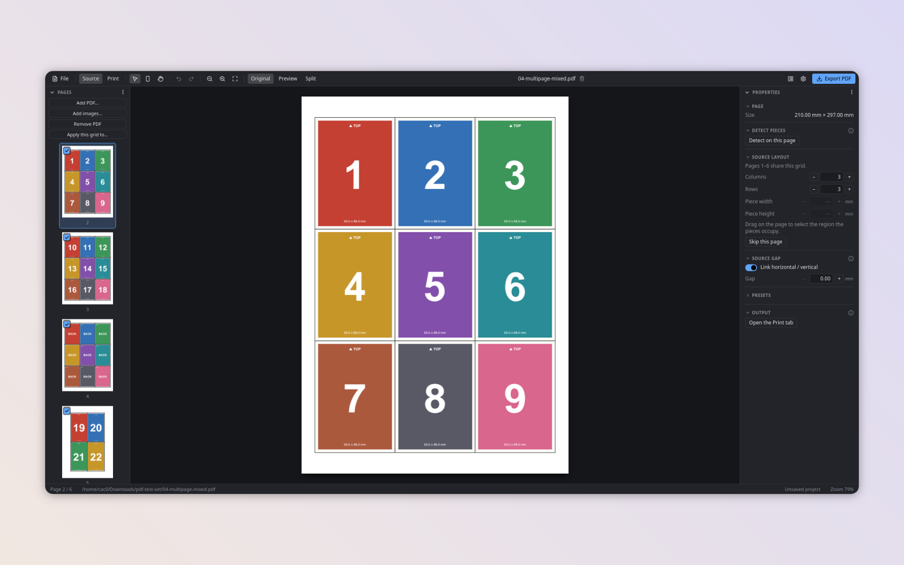

<picture>
  <source media="(prefers-color-scheme: dark)" srcset="assets/brand/logo-dark.svg">
  
</picture>

# Gutterberg

Gutterberg turns print-and-play PDFs and card scans into cut-ready sheets: exact card sizes, clean gutters, and the original artwork untouched.

[](https://github.com/JoaquinArruiz/Gutterberg/actions/workflows/ci.yml)
[](https://github.com/JoaquinArruiz/Gutterberg/releases/latest)
[](https://github.com/JoaquinArruiz/Gutterberg/releases)

[](LICENSE)




<!-- GIF: marking pieces on a page -->

| Print tab | Detect pieces | Several pages |
| --- | --- | --- |
|  |  |  |

<!-- GIF: the Print tab -->

<!-- GIF: export -->

## Download

Get the latest version from the **[Releases page](https://github.com/JoaquinArruiz/Gutterberg/releases/latest)**
and pick the file for your system:

| System | File |
| --- | --- |
| Windows | `Gutterberg_<version>_x64-setup.exe` (or the `.msi`) |
| macOS, Apple silicon (M1 and later) | `Gutterberg_<version>_aarch64.dmg` |
| macOS, Intel | `Gutterberg_<version>_x64.dmg` |
| Linux | `Gutterberg_<version>_amd64.AppImage` (make it executable, then run it) or the `.deb` |

Gutterberg checks for new versions by itself (Preferences › Updates) and installs them when you say so. On Linux
the update replaces the AppImage; if you installed the `.deb`, update by downloading the new `.deb`.

### The first time you open it

The builds are not signed with an Apple or Windows certificate, so your system warns you the first time. The
app is the same one you can build from this repository.

- **macOS:** right-click the app and choose **Open**, then confirm; or open **System Settings › Privacy &
  Security** and press **Open Anyway** after the first attempt.
- **Windows:** when SmartScreen says it protected your PC, press **More info**, then **Run anyway**.

## Features

**Source tab: say where the pieces are**

- Draw the region of the pieces on a PDF page and set its rows and columns, or draw each piece on its own with the
  Piece tool (movable, resizable and rotatable). Sizes are exact, in mm, cm or inches.
- **Detect pieces** proposes the grid or the rectangles of a page from the PDF's own objects, from repeating
  edges, or from the shapes in a scan. It is a draft until you apply it.
- Source gap, output gap, margins and page size; **Original**, **Preview** and **Split** views; skip pages;
  give page ranges their own grid; save grids as presets.
- A pre-flight check lists the pages that cannot be exported before anything is written.

**Print tab: choose what goes on the sheets**

- A piece library with copies per piece, from several PDFs at once; plan the sheets or fill them automatically.
- Turn pieces, sort them by dragging, and set a real size (for example 63 × 88 mm) or a percentage per piece,
  always a visible, explicit choice. Overflow is reported, never fixed by shrinking.
- Cut marks, bleed, and duplex printing with a common back or a back per piece.
- Export keeps the original vector content: pieces are placed and clipped, never turned into pictures.

**Images and scans**

- Add PNG, JPEG or WebP images as pieces, with the size set once for all of them. Images are never resampled,
  and a JPEG goes into the PDF byte for byte. Soft or blurry images are flagged before you export.

**Projects**

- `.gtr` project files keep everything but the PDFs, which they find again by content even if they moved.
  Double-clicking a project opens it in Gutterberg. Undo and redo cover the whole project.
- PDFs locked by their publisher against printing or changes are not exported; other restrictions are kept.

**AI Mode (optional)**

- Off and hidden until you turn it on. Detect pieces and Sort pages with an AI engine of your choice
  (Anthropic, OpenAI-compatible, Gemini or Ollama), with your own key kept in the system keychain. Every action
  asks first what is sent and what it costs, and every result is a proposal you can edit.

**Languages and help**

- English and Spanish, a welcome tour, help tips, a keyboard shortcuts sheet and a bug report form that
  fills in your version and system. The full list of controls is in [docs/controls.md](docs/controls.md).

## Why

> **TODO (owner): write this section.** Why Gutterberg exists, in your own words.

### Why not just use…

> **Draft: owner to review.** Written by the assistant from the kinds of tools there are, without naming or
> judging any product. Edit it, cut it or replace it.

- **A general PDF editor?** It can crop and arrange pages, but re-spacing pieces that are packed edge to edge is
  slow work by hand, piece by piece.
- **Print-shop imposition software?** It is made for arranging whole pages on press sheets, not for cutting
  pieces out of a page, and it is usually paid and complex.
- **An online print-and-play or proxy maker?** Most take images, turn everything into pictures (losing the
  PDF's sharp vector content) and need your files uploaded.
- **A command-line tool or script?** It can do parts of this, but most rasterise too, and they are not for
  everyone.

## Examples

Nine small PDFs to try it on, from a plain 3 × 3 sheet to a rotated page, a scan and a locked file, with what
each shows and what to expect: [examples/README.md](examples/README.md).

## Build from source

You need Node 20 or later, [pnpm](https://pnpm.io/), Rust, and on Linux the Tauri dependencies
(`webkit2gtk-4.1`, `gtk3`; see the [Tauri prerequisites](https://v2.tauri.app/start/prerequisites/)).

```sh
git clone https://github.com/JoaquinArruiz/Gutterberg.git
cd Gutterberg
pnpm install
scripts/fetch-pdfium.sh        # downloads pdfium into src-tauri/resources/pdfium
pnpm tauri dev                 # runs the app
```

The checks, as CI runs them:

```sh
pnpm lint
pnpm typecheck
pnpm test
cargo fmt --check
cargo clippy --workspace -- -D warnings
cargo test --workspace         # the render tests need pdfium: PDFIUM_LIB_PATH=<dir containing libpdfium>
```

How a release is made is in [docs/releasing.md](docs/releasing.md).

## Roadmap

## Contributing

Contributions are welcome: see [CONTRIBUTING.md](CONTRIBUTING.md). Found a bug? Use the
[issue form](https://github.com/JoaquinArruiz/Gutterberg/issues/new/choose), or Preferences › Help › Report on
GitHub in the app, which fills in your version and system.

## License

[PolyForm Noncommercial 1.0.0](LICENSE). Free for personal and noncommercial use. For any commercial use, or if
you're not sure whether your use counts, contact me: joaquinarruiz@gmail.com. The software comes as is, without
warranty.
